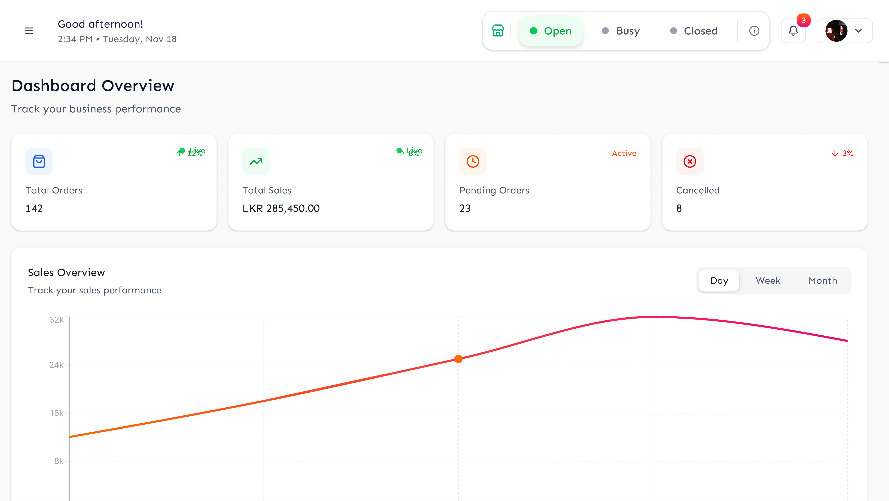
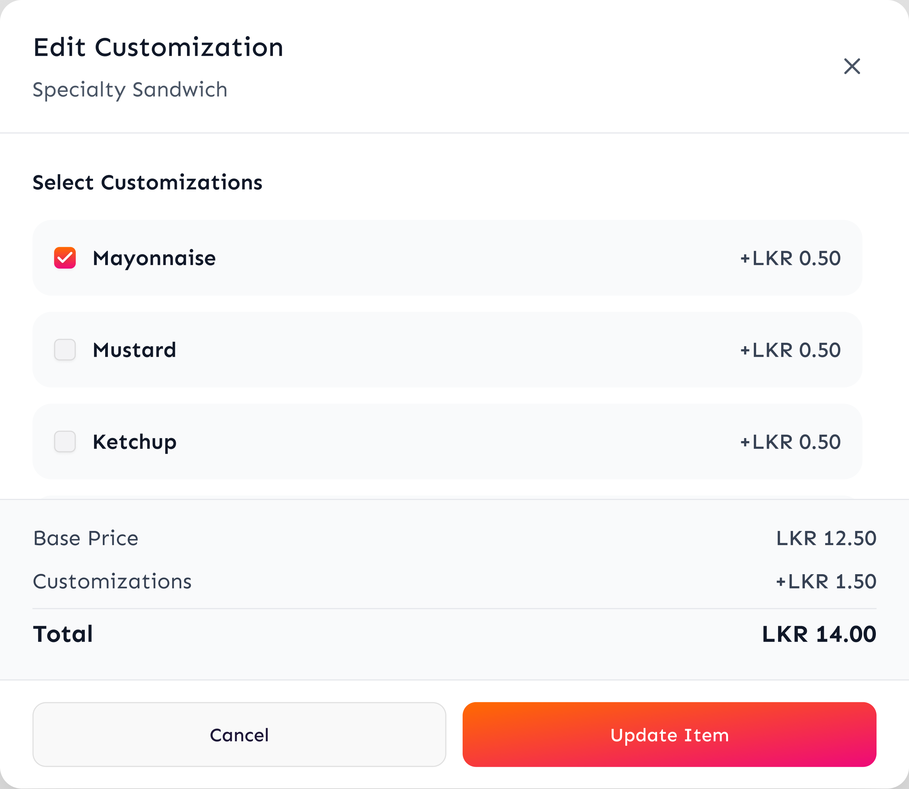
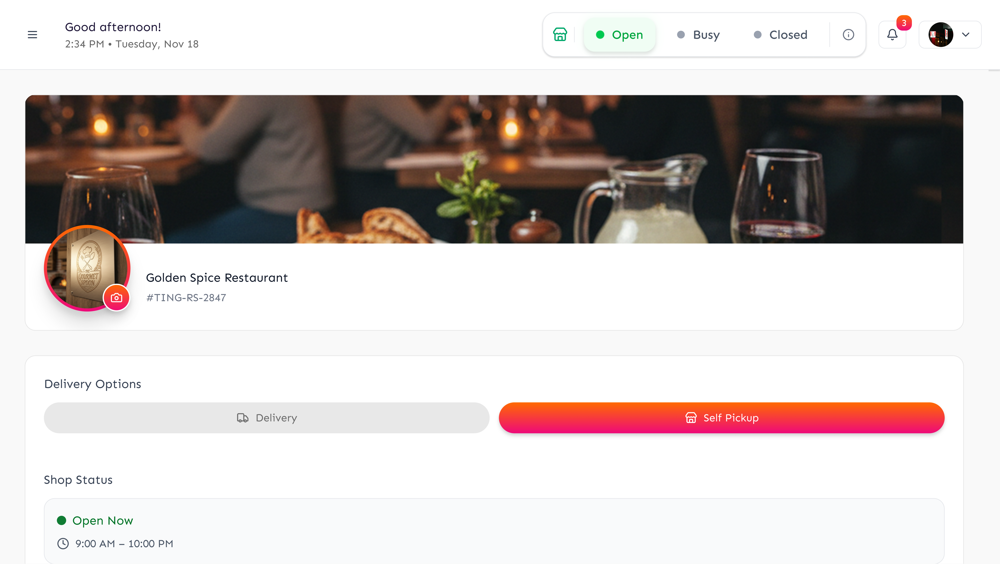
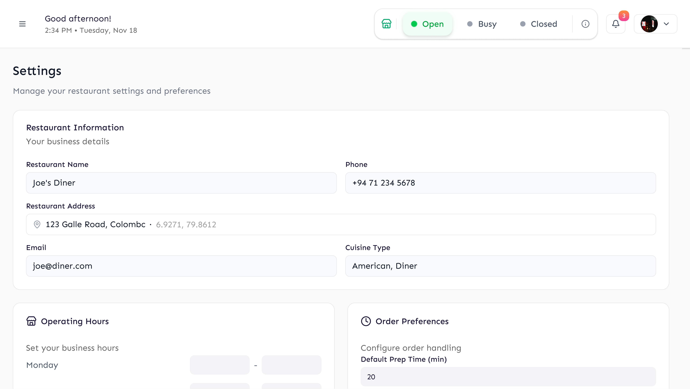

# 🏪 VendorHub Merchant App UI/UX Case Study

VendorHub is an all-in-one business management platform built for merchants to manage their digital storefronts, incoming orders, and inventory effortlessly. This specific design is optimized for **Tablet Devices**, providing a wider workspace for complex operations.

---

### 🔍 Project Overview
- **Goal:** To simplify the complexities of online business operations through a clean, data-driven, and highly responsive tablet dashboard.
- **Role:** Senior UI/UX Designer.
- **Design Process:** Stakeholder interviews, iterative design cycles, and focus on data visualization for larger screens.

### 🎨 Key Features
* **Tablet-Optimized Interface:** Maximized screen real estate for efficient multitasking.
* **Order Management System:** Streamlined interface to track, prepare, and dispatch orders in real-time.
* **Inventory Control:** Easy-to-use tools for item availability and customization updates.
* **Dark Mode Support:** Reduced eye strain for merchants operating in low-light environments.

---

### 📸 UI Design Highlights (Tablet Version)

| Dashboard | Order Management | New Order |
| :---: | :---: | :---: |
|  |  |  |

| Customisation | Item Availability | Order History |
| :---: | :---: | :---: |
|  |  |  |

| Live Tracking | Profile | Settings |
| :---: | :---: | :---: |
|  |  |  |

#### 🌙 Dark Mode UI Samples
*(A comprehensive view of the dark theme application)*

---

### 🔗 Live Interactive Prototype
Experience the fully functional tablet prototype on Figma:
👉 **[View VendorHub Merchant App Prototype](https://www.figma.com/make/11m4mu4ISVhW7Q2IF7nyPx/Merchant-app?fullscreen=1&t=d2iVjNf9at39q7bF-1&code-node-id=0-9)**
